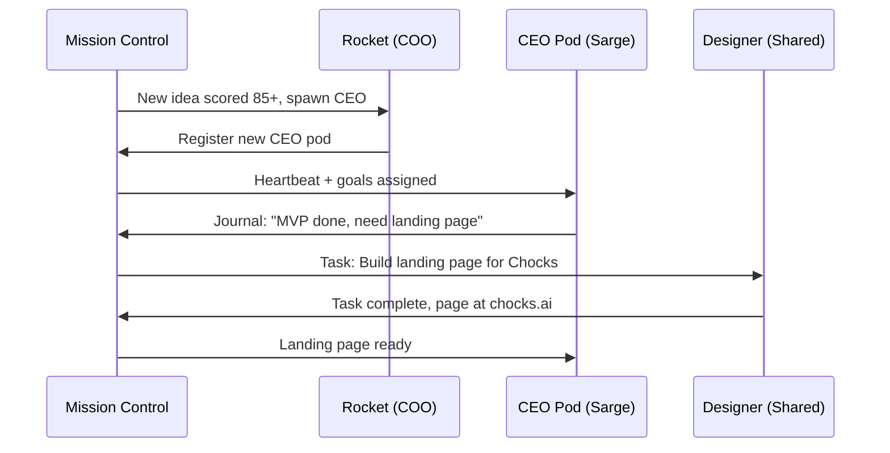

# Fleet Architecture: CEO Pods + Shared Services

> **Status:** Concept / RFC
> **Author:** Dustin + Antigravity
> **Date:** 2026-02-19
> **Goal:** Design an architecture that scales to unlimited autonomous SaaS products while maintaining operational sanity.

---

## Context

Negative Zero runs an autonomous SaaS product lifecycle pipeline:

```
Prospector (find ideas)
    → score_pipeline.py (rank by weighted criteria)
    → Spawn Product CEO (dedicated agent per product)
    → CEO builds MVP → Designer creates landing page → CMO markets
    → Gardener monitors health → Accountant tracks revenue
```

Currently all 13 agents live on **one OpenClaw gateway** on one VPS. The pipeline has 4 ideas at `research_complete` waiting to spawn CEOs. Adding them puts us at 17+ agents sharing one process, one config file, one browser, one set of API keys.

### The Scaling Wall

| Agents | Status |
|--------|--------|
| 13 | Current. Works, but config is 756 lines and skill dedup is noisy |
| 17-20 | Imminent. Spawning queued CEOs. Gateway starts straining |
| 30+ | Pipeline keeps generating ideas. Single-instance ceiling |
| 100+ | The actual goal. $1M MRR = many products at $1k-10k each |

---

## Architecture: Two-Tier Agent Model

### Insight: Agents Are Two Types

| Type | Purpose | Examples | Lifecycle |
|------|---------|----------|-----------|
| **Product CEO** | Owns a product, codebase, domain, revenue target | Closer, Captain, Sarge, Envoy, Warden | Long-lived, stateful, isolated |
| **Shared Service** | Pipeline function any CEO can invoke | Prospector, Designer, Ric-Flare, Gardener, Refiner, Accountant | Long-lived but stateless per-product |

CEOs need **isolation** (own config, own skills, own browser, own resources). Shared services need **proximity** (respond to requests from any CEO).

### Target Architecture

```
┌──────────────────────────────────────────────────────┐
│                  Mission Control                      │
│         Fleet Dashboard · Multi-Gateway API           │
│     Heartbeats · Goals · Task Queue · Registry        │
└───────┬────────────┬───────────┬─────────────────────┘
        │            │           │
   ┌────▼────┐  ┌────▼────┐  ┌──▼──────┐
   │CEO Pod 1│  │CEO Pod 2│  │CEO Pod N│     ← Isolated OC instances
   │ Sarge   │  │ Captain │  │ Future  │       per product CEO
   │(Chocks) │  │(ShipLog)│  │ CEO...  │
   └────┬────┘  └────┬────┘  └────┬────┘
        │            │            │
   ┌────▼────────────▼────────────▼────────┐
   │         Shared Services Pod            │
   │      (Single OC instance — Rocket)     │
   │                                        │
   │  Rocket (COO/orchestrator)             │
   │  Prospector · Designer · Ric-Flare     │
   │  Gardener · Refiner · Accountant       │
   │  Architect                             │
   └───────────────────────────────────────┘
```

### Communication Flow



**Key:** CEO pods don't talk to shared services directly. Mission Control is the message bus. This prevents tight coupling and means pods can be on different machines.

---

## What Changes in Mission Control

### Gateway Registry

MC needs to know about multiple OC gateways:

```typescript
// New: gateway registry in MC database
interface GatewayRegistration {
  id: string;              // "sarge-pod"
  gatewayUrl: string;      // "ws://10.0.0.5:18789"
  agentIds: string[];      // ["sarge"]
  product: string;         // "Chocks"
  status: "healthy" | "degraded" | "offline";
  lastHeartbeat: Date;
}
```

### Cross-Instance Task Queue

Shared services receive work from any CEO via MC:

```typescript
// New: task dispatch
interface TaskAssignment {
  from: string;           // "sarge" (CEO)
  to: string;             // "designer" (shared service)
  type: "landing-page" | "marketing-campaign" | "pr-review" | ...;
  payload: Record<string, unknown>;
  priority: "urgent" | "normal" | "background";
}
```

### Aggregate Dashboard

The existing MC dashboard expands to show all pods:

- Health status per pod (green/yellow/red)
- Revenue per product
- Active tasks across all CEOs
- Resource utilization per pod

---

## Migration Path

### Phase 1: Now (13 agents, current setup)
- Keep single OC instance
- Skill reorganization done ✅
- Mission Control operational ✅

### Phase 2: Proof of Concept (next CEO spawn)
- Spawn next CEO (e.g., War Planner) as a **separate OC instance** on the same VPS
- Add gateway registry to MC
- Validate cross-instance heartbeats work
- Keep shared services on Rocket's instance

### Phase 3: Production Multi-Pod (20+ agents)
- Template for CEO pod provisioning (see `infrastructure-scaling.md`)
- Automated `openclaw init` + config generation
- Shared services remain centralized
- Add cross-instance task queue

### Phase 4: Multi-Machine (50+ agents)
- CEO pods on separate VPS instances or containers
- MC becomes the single control plane
- Auto-scaling infrastructure (see `infrastructure-scaling.md`)

---

## Open Questions

1. **OpenClaw multi-instance support** — Does OC support running multiple gateways on different ports on the same machine? Need to test port conflicts.
2. **Browser sharing** — Can CEO pods share a single Chrome instance, or does each need its own? RAM implications.
3. **Skill inheritance** — Do CEO pods need their own copy of shared skills, or can they reference `~/.openclaw/skills/` from the same user?
4. **License implications** — Does running N OpenClaw instances require N licenses?

---

*See also:*
- [infrastructure-scaling.md](./infrastructure-scaling.md) — VPS vs Railway, cost modeling
- [ai-drift-prevention.md](./ai-drift-prevention.md) — Immutable configs, guardrails
